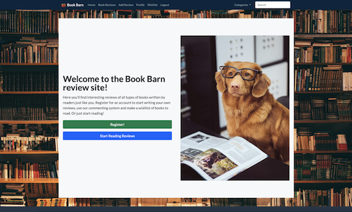
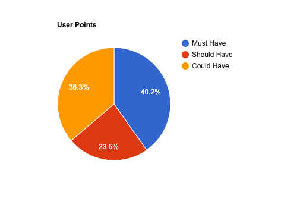
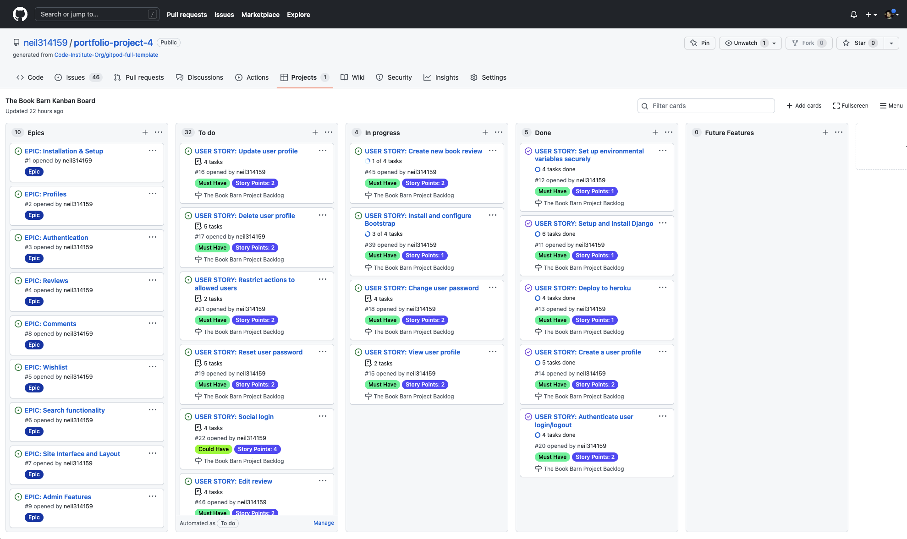
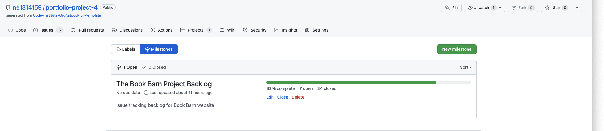
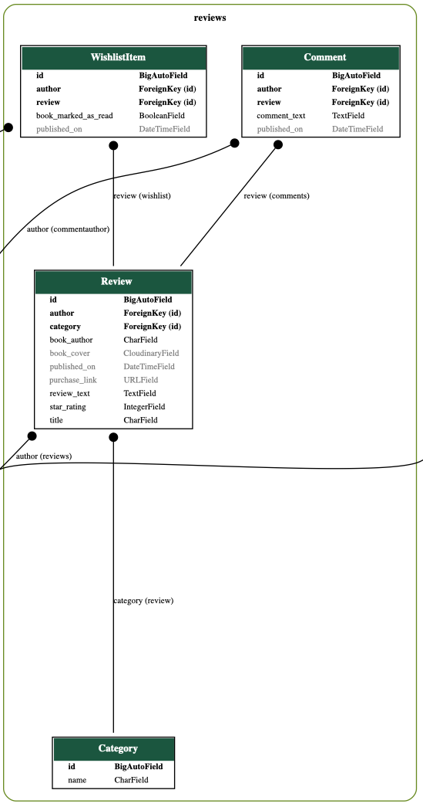
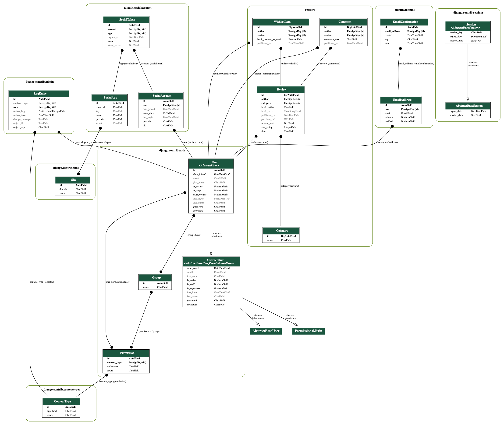

# Book Barn Reviews

## Introduction

Book Barn Reviews is a site designed for book lovers around the world. When you read a great book, the first thing you want to do is tell someone else about it! This site lets you publish your own reviews and also look at reviews from other users to get new ideas. Users can interact with each other via a commenting system, and can also create a wishlist of books they have not yet read. The site is built with the Django framework in Python, and also uses HTML and CSS.

This is my fourth Portfolio Project for the Diploma in Software Development with the Code Institute.

The project demonstrates working CRUD implementations for a number of data models including Reviews, Comments, and Wishlist Items. 

 

 

[Visit the live website on Heroku here](https://book-barn-reviews.herokuapp.com/)

 

View information about testing in the [testing.md file here](TESTING.md)

 

## Table of Contents

  * [Introduction](#introduction)
  * [UX](#ux)
    + [Strategy](#strategy)
      - [Epics](#epics)
      - [Translation to User Stories](#translation-to-user-stories)
      - [Agile Management](#agile-management)
    + [Scope](#scope)
    + [Structure](#structure)
      - [Design Structure - Site layout](#design-structure---site-layout)
      - [Information Structure - Database Models](#information-structure---database-models)
    + [Skeleton](#skeleton)
      - [Wireframes](#wireframes)
    + [Surface](#surface)
  * [Features](#features)
  * [Future Features](#future-features)
  * [Technologies Used](#technologies-used)
  * [Testing](#testing)
  * [Notable Bugs](#notable-bugs)
  * [Security](#security)
- [Deployment](#deployment)
- [Credits](#credits)
- [Acknowledgements](#acknowledgements)

## UX

### Strategy

The overall aim of the project is to develop a platform that allows users to create and share book reviews with others around the world.

* Site Goals
    * To enable users to write their own reviews and publish them online
    * To let users browse exsiting reviews for reading ideas
    * To have a design with pleasing visuals and functional layout

* User Goals
The ideal user is excited about reading, looking for new books to read, willing to share their recommendations and wants to interact with with other readers.

#### Epics

At the beginning of the project, ten Epics were created and can be viewed at the [Kanban board here](https://github.com/neil314159/portfolio-project-4/projects/1).
* Installation and Setup
* Profiles
* User Authentication
* Reviews
* Comments
* Wishlist
* Search
* Site Interface
* Admin Features
* Testing Strategy

#### Translation to User Stories

1. Installation and Setup
    * US11: Setup and Install Django - As a developer, I can set up django and the necessary software packages, so that I can deploy the site and begin development
    * US12: Set up environmental variables securely - As a developer, I want to set up the secret keys and database variable in a secure manner, so that they are kept hidden when deployed and not accidentally exposed through github
    * US13: Deploy to Heroku - As a developer, I want to ensure that the deployment pipeline is functioning, so that I can commence development on the project and test on heroku as well as the local environment
1. Profiles
    * US14: Create a User Profile - As a user, I can create a new account on the Book Barn website, so that I have the permissions required to publish my own reviews on the site
    * US15: View User Profile - As a user, I can log into the site and view my own profile page, so that I can see a list of all reviews I have written and edit or delete them
    * US16: Update User Profile - As a user, I can view my own profile page and edit my username, so that I can change the name displayed on my reviews that is displayed to other users and site visitors
    * US17: Delete User Profile - As a user, I can delete my own account, so that I can remove my information and content from the site if I desire
    * US18: Change User Password - As a user, I can change my password, so that my account remains secure
    * US19: Reset USer Password - As a user, I can reset my password, so that can access my account if my password is forgotten
1. User Authentication
    * US20: Authenticate user login/logout - As a user, I can log and and out of the site, so that my personal details and content are kept secure
    * US21: Restrict actions to allowed users - As a developer, I want to only allow certain actions when the user is logged in, so that users are unable to access data from other users
    * US22: Social Login - As a user, I can sign into the site using another account such as Google or Facebook, so that do not have to sign up for a new account and remember another password
1. Reviews
    * US45: Create new book review - As a user, I can write and save a new book review on the site, so that other users may see it and get ideas about new books to read
    * US46: Edit review - As a user, I can edit my published book reviews, so that update my reviews with new information or correct any errors
    * US47: Display Reviews - As a user, I can view articles reviewing books on the site, so that I can learn about new books I might like to read
    * US48: Delete reviews - As a user, I can delete a review that I have written, so that it is removed from the site
    * US49: Book cover image - As a user, I can upload a cover image for the book review, so that the book cover can be shown on the site when users browse or search for reviews
    * US50: Book cover API - As a user, I can search books by title, so that a book cover image is automatically found and added to my review
    * US51: AJAX category editing - As a user, I can create a new category when writing a review, so that my article is published under the most suitable genre
1. Comments
    * US26: Leave user comments on reviews - As a user, I can write a comment on my own or other reviews, so that I can interact with other users on the site
    * US27: Moderation for comments in admin panel - As a site owner, I can view all comments on the site through the admin interface and delete them if required, so that inappropriate comments are not publicly displayed
    * US28: Allow users to manage comments on their own reviews - As a user, I can delete comments left by other users on my own reviews, so that inappropriate comments are not displayed next to content I have written and the administrative burden is lightened for the site owner
1. Wishlist
    * US23: Add/remove books from wishlist - s a user, I can click on a like button on each review, so that the book is saved to my wishlist and I can keep track of new books to read
    * US24: View wishlist on profile page - As a user, I can click on my wishlist link, so that I can see at a glance a list of all the books on my wishlist
    * US25: External purchase link - As a user, I can view my wishlist of saved books and click on a purchase link, so that I can easily buy books I am interested in
1. Search
    * US29: Sitewide search - As a user, I can type text into the search box in the navigation bar, so that I can find matching text in any reviews on the site
    * US30: AJAX live search - As a user, I can type text into the search box in the navigation bar, so that I see a continuously updated set of search results as I type
    * US31: Category-based view - As a user, I can select a category from a drop-down menu in the navbar, so that I can view books that interest me the most in a particular genre
1. Site Interface
    * US39: Install and configure Bootstrap - As a developer, I want to use a flexible framework, so that the user interface of the site can be made consistent and usable
    * US40: Night Mode - As a user, I can select the choice between normal and dark mode, so that I can use the site with the colour scheme I prefer
    * US41: Responsive layout on different devices - As a user, I want to have the site be responsive across different devices, so that I can enjoy a consistent experience and access the site from laptop, phone or tablet
    * US42: Form styling - As a site owner, I want all forms on the site to be styled in a similar fashion, so that the user interface is consistent across the whole site
    * US43: Accessibility - As a user, I can make use of accessibility features on the site, so that I can navigate and use the site without difficulty
    * US44: User feedback messages - As a user, I can receive clear and unambiguous feedback about my actions, so that I can be sure that each operation was carried out successfully
1. Admin Features
    * US32: Admin area data formatting - As a site owner, I can log into the admin area and see all comments, reviews and wishlists, so that I can monitor the overall operation of the site and keep an overview of all content posted
    * US33: Category Managment - As a site owner, I can log into the admin area and add, edit and delete the categories for book reviews, so that book reviews on the site are properly organised
    * US34: Review of the week - As a site owner, I can select a book review to be highlighted on the main home page, so that high quality content is presented to new users
1. Testing Strategy
    * US35: Automated Testing - As a developer, I want to deploy automated testing with high code coverage, so that I can reduce the number of bugs in the site and improve the user experience
    * US36: Manual testing - As a developer, I want to manually test every aspect of the interface and functionality of the site, so that users can have a bug-free and consistent experience 
    * US37: Third party testing - As a developer, I can ask an independent person to test out the site while I watch, so that note any bugs or any part of the interface which is not easily understood
    * US38: Code Validation - As a developer, I want all of the code in the site to conform to best practices, so that it is clear, readable and bug-free

All of the completed user stories are available on the Kanban board found [here](https://github.com/neil314159/portfolio-project-4/projects/1), where the acceptance criteria and implementation actions for each story are visible by clicking on each individual issue. For example, the user story [US49](https://github.com/neil314159/portfolio-project-4/issues/49) is as follows:
 
 
Title: US49: Book Cover Image

User Story: As a user, I can upload a cover image for the book review, so that the book cover can be shown on the site when users browse or search for reviews

Acceptance Criteria:
- Acceptance Criteria 1
	Given that I am logged in and registered on the site
	When I am creating a review
	Then I will see a field to upload an image for the book cover
- Acceptance Criteria 2
	Given that I have written a book review on the site
	When I do not upload an accompanying cover
	Then a default image is provided

Tasks:
- [x] link cloudinary API in the templates and setting files
- [x] resize the image to appropriate dimensions and ration before using
- [x] add a default cover if no image is uploaded

Epic: #4 

 
 

#### Agile Management
Throughout the development process, these epics and user stories were managed using the Kanban Board functionality built into Github. The Epics were created, developed into user stories using the Project interface in Github. The User Stories were created as issues with attached task lists and acceptance criteria, and were moved between columns to designate progress on a particular task. Once an issue was completed it was closed and moved to the Done column. The milestone tracker was also used to indicate overall progress and the project backlog.

The label function for Github issues was used to assign Must Have, Could Have and Should Have status, and unfinished tasks were assigned Won't Have at the end of the sprint. Labels were also used to indicate the number of user points assigned to each User Story.

Overall, 82% of issues/User Stories were completed and marked closed, with a number of features remaining for future sprints.

 

 

 

### Scope

After creating the Epics and translating them into User Stories, this now leads to a list of concrete features to implement
* Reviews - can be viewed by all users
* Reviews - can be created, viewed, edited and deleted by users
* Categories - can be created by an administrator and applied by users to their reviews
* Comments - can be created, viewed, edited and deleted by users
* Wishlist - items can be added, removed and edited by users
* Users - can register, login, change password and reset password
* Users - can search the site
* Users - all operations can only be carried out with proper permissions

### Structure

#### Design Structure - Site layout
* A simple and straightforward site layout was adopted to make the site easy for users to navigate.
* All forms for creating, editing, viewing and deleting information are simply presented and easy to understand.

#### Information Structure - Database Models

In order for the site to provide full functionality to the user, a number of custom models must be defined. These models reflect the information that will be stored and used by the site. In this case, we have a custom model representing a book review, which includes information such as title, author, the author of the review, the rating and text content of the review and the date the review was published. There is also a Cloudinary field which accepts image uploads to store the cover image of the book. The review model links to the standard user model provided by Django, representing registered users on the site. Another simple model was created to represent Categories, and each review has a Category field. This means the administrator can define new categories in the site's admin section. There is a model which stores user comments, each comment linking to a review and a user and containing comment text. Finally, there is a wishlist item  which stores a book review, a user and a Boolean value indicating if the book has been read or not.

Below you can see the full schema for the whole site, including the standard user models, and there is also an excerpt of the custom models found in the reviews app of the project. These images were generated using the Django-extensions package, which creates a .dot file which can then be copied into [this site](https://dreampuf.github.io/GraphvizOnline/) to generate a downloadable image.

 

### Skeleton

#### Wireframes
Balsamiq was used to create the wireframes for this project. The initial layout of the site remained largely the same during the development process, except for the profile page and the wishlist being separated into two pages rather than combined into one. The wireframe for the review index page was also used for the search results and category view pages as they are functionally very similar.

* Homepage

* Review Listing

* Review Detail

* Profile/Wishlist Page

### Surface

* Fonts
The Lato font was chosen for this project as it is extremely legible and suitable for a literary site, but also more visually interesting than the standard Bootstrap font of Helvetica Neue.

* Images
User feedback indicated a preference for background pictures rather than the plain coloured backgrounds I initially used. Pictures were chosen from Unsplash to be colourful and well-textured to draw the interest of the users.

* Colours
A simple and clean colour palette was chosen using the website [Coolers](http://coolors.co). A more muted set of colours was used because there were also eye-catching photos being used, as well as book covers, and too much visual information could distract the user.

## Features

#### Static Homepage
The homepage explains the purpose of the site to new users, and explains that they can register for an account for extra advantages, or else start browsing the site directly.

#### Navbar
The navbar appears at the top of every page on the site, giving users access to every section of the site. Only logged in users will see the links for adding a review, the profile page and the wishlist page. Logged out users will see links to register and login instead of the logout link here.

#### Dropdown and Search Menu
On the right hand side of the navbar are the drop-down category list and the search box. The category list is populated from the database and directs users to a page showing books from each genre. The search box takes the user's search term when they hit enter and provides a page of matching results.

#### Reviews Index
This page provides the main functionality of the site, it shows a paginated list of all the reviews published on the site in reverse chronological order. The user can see all the reviews available here at a glance. The use of the cover images from the books makes the page more engaging and attractive.

#### Create Review
This form allows the user to create their own review for publication on the site. The instructions at the top let them know which fields are mandatory. They enter the book details, upload a photo of the cover if they wish and click submit.

#### Book Review Card
This UI element gathers all the data about a book and presents it to the user in a variety of contexts, for example in the reviews index, in the search page, in the category listing. It shows the book cover, the author and title of the book, the reviewer and the number of stars the reviewer gave the book. Both the cover image and the Read Review button provide a link to a detailed view of the book review.

#### Detailed Review
When the user clicks on an individual review, this page shows them the full details including the text of the review. The user is also given the option to add the book to their wishlist or purchase it if the reviewer included a link. If the user is logged in and looking at one of their own reviews, they will also be presented with buttons to edit or delete the review.

#### Login/Signup
These two forms let unregistered users sign up for a new account, or registered users log back in. If the user forgets their password, there is a link for them to reset it if they have supplied an email account.

#### Search and Category Views
These pages have a similar layout and function. They display the results of the user clicking on a category view from the drop down menu in the navbar, or from searching for a term in the search box in the navbar.

#### Profile Page
This page has two main functions. First, it allows the user to manage their email and password preferences. They can change their email address and their password. The user can also choose to delete their own account.

Below this section the user can also see a table listing all of the articles they have written, which can be clicked on to bring them to the article.

#### Wishlist Page
Here the user can see a listing of all the books they have added to their wishlist. They can remove the book if they choose. If the original reviewer included a purchase link in their form, then the link will appear here and will be opened in a new window. 

Books in this list can also be marked as read or unread. Toggling this state with the Mark as Read button will add a strikethrough to the title to signal that the book has been read.

#### Comments
The commenting system appears on individual review pages. Any logged in user can leave a comment on any review. They can also later edit or delete this comment. Additionally, the original author of any review page has the ability to remove comments on their pages if they wish, in order to provide a level of user moderation.

#### Footer
This footer appears at the bottom of every page on the site and provides easy access to the social media links for the project.

## Future Features

There a number of potentially beneficial user features which were not implemented in this sprint. You can view the Kanban board for this project [here](https://github.com/neil314159/portfolio-project-4/projects/1) to see which items were left to be developed at a future date.
* Book Cover API - rather than having to manually search for a book cover image, this could search and retrieve the image for the user using the Google Books or Goodreads API.
* AJAX editing -  In order to have instant, on-page editing for categories, reviews and comments, it is necessary to implement AJAX using Javascript so that the user no longer has to refresh the page to see the results of their actions. It is also possible to use the HTMX library with Django to achieve similar functionality.
* Night mode - Some users prefer to able to change the colour scheme on a site themselves, and this feature would allow them a certain level of control.
* Social login - it is possible to use the AllAuth package to implement logins using social account credentials such as a Facebook or Google account. Technically this is not very difficult using third-party libraries, but your site must often be verified and approved by the API providers before you can use their credentials to log in users.
* Book of the week - a nice feature for the site administrator would be the ability to select and highlight a certain book review on the static home page for greater visibility.
* User messages - commenting has been implemented already but the ability for users to message each other directly would be beneficial and engaging.
* Shared wishlists - since wishlists already exist for users, they could potentially share them with other users on the site for reading recommendations.

## Technologies Used

* Python
    * These Python modules were used for the project:
        * asgiref==3.5.1
        * cloudinary==1.29.0
        * coverage==6.3.2
        * dj-database-url==0.5.0
        * dj3-cloudinary-storage==0.0.6
        * Django==3.2.13
        * django-active-link==0.1.8
        * django-allauth==0.50.0
        * django-crispy-forms==1.14.0
        * django-extensions==3.1.5
        * gunicorn==20.1.0
        * oauthlib==3.2.0
        * psycopg2==2.9.3
        * pydot==1.4.2
        * PyJWT==2.3.0
        * python3-openid==3.2.0
        * pytz==2022.1
        * requests-oauthlib==1.3.1
        * sqlparse==0.4.2

* Of the above packages, the most important ones were:
    * Cloudinary, for storing both site and user images and providing static storage
    * AllAuth, for providing user authorization management. This package takes care of allowing users to register, log in and out, reset their passwords, and use email addresses for account  confirmation and password reset
    * Crispy Forms, which was used to provide easy Bootsrap styling to the forms generated by Django
* Django
    * Django is a mature, high-level Python framework used to develop and deploy websites
* Sendgrid
    * The SendGrid API allows Django to send out emails for user account operations without having to use a personal email account to send from. This should lead to better deliverability and less chance of emails being marked as spam. I could only use SendGrid with my personal domain as they disallow Gmail addresses.
* HTML
    * HTML was used mainly to style the templates used by Django for displaying the front end of the site.
* CSS
    * A small amount of CSS was written to style the background and fonts for the project.
* Bootstrap
    * A comprehensive CSS framework used to quickly provide layout and styling for web pages
* Font Awesome
    * The Font-Awesome icon library was used for the social media links in the footer of the site.
* Heroku
    * The project was deployed on Heroku's cloud-based platform
* Heroku PostgreSQL
    * The database functionality was provided by the Heroku Postgres Add-on

#### Other Resources Used
* [Github](https://github.com) 
    * GitHub is used for version control and as a repository for the code of the project.
* [Gitpod](https://gitpod.io) 
    * Gitpod was the development environment for this site and linked to Github for storage and deployment.
* [MacOS Preview](https://support.apple.com/guide/preview/welcome/mac)
    * All screenshots were captured and edited with this program.
* Balsamiq
    * Used to develop and refine wireframe images in the planning stage of the project.
* Cloudinary API Reference
    * This was used to understand how to apply image transformations when uplaoding and storing images on their service.

## Testing

A comprehensive manual testing plan was used for this project. A full description of all of the procedures and methods used can be found in the [testing.md file here](TESTING.md). All functionality relating to user actions and CRUD operations was carefully examined. Wherever possible, testing was also related back to the acceptance criteria in the original Epics defined before development began.

## Notable Bugs

1. Slug Creation
    * Problem: The use of a Django slug is often desirable for publishing articles on a website as it helps to provide a more user-readable URL. In this project, I encountered problems in trying to ensure that no two articles with the same title could ever produce an identical slug. Initially I used a third party component from the Django Extensions package, which was able to create a unique slug but failed when the title had more than one world. I then reverted to generating the slug manually but could not reliably ensure that the same slug would not exist for two reviews of the same book.
    * Solution: I removed the slug from the Model used to represent the book reviews in the database and switched to using an Int-based ID identifier instead. This is slightly less readable but is very effective at guaranteeing uniqueness. In the future it would be possible to switch to a UUID-based identifier instead.

2. Success URLs
    * Problem: For most of the project I encountered issues when supplying a Success URL for the Comment Model. This is the address used to redirect to after the comment is created, and I had difficulty in properly capturing the ID of the review connected with the comment.
    * Solution: After reading and watching some tutorials on how to properly reference attached objects, I was able to fix the get_success_url function and properly redirect the user once they had written or edited a comment.

3. Delayed Emails
    * Problem: Many of the emails necessary for users to register an account, confirm their email address and reset their passwords were taking a long time to arrive, up to 10 or 15 minutes.
    * Solution: After contacting SendGrid, they informed me that using this API to send emails on a free tier of service would often entail delays.

## Security

When this project was initially created, the secret key included with the Django installation was committed to Github accidentally. This key was quickly changed and hidden through the environment variables in env.py before deployment to Heroku.

# Deployment

## Creating the Project
1. A new repository was created for the project on GitHub by clicking 'New Repository' on the GitHub user page, giving a name to the project.
1. The GitPod link created by the Chrome extension was clicked on the Code Institute Python template found [here](https://github.com/Code-Institute-Org/python-essentials-template).
1. This created a virtual workspace which was then linked to my GitHub account.
1. After writing code for the project, I used git commands add, commit and push which sent all the project files from GitPod to my GitHub repository.

## Deploying to Heroku
The project was deployed on the Heroku site by using these steps:
1. Create a new account on Heroku.
1. Log into your account.
1. Click on the 'New' button and click 'Create New App'.
1. Choose a new name for your app, which must be unique to your app.
1. Select the Resources menu option from the top of the page.
1. Search in the Add-ons search box for Heroku Postgres.
1. Select the Heroku Postgres Add on from the results list and accept the hobby level tier.
1. Click on the settings tab and go to the hidden variables section.
1. Here you can add your SECRET_KEY variable which is hidden within the env.py in your Django project.
1. You can also add a key for static storage such as Cloudinary.
1. Click the Deploy tab in Heroku.
1. Normally, you could link to your Github repository through this page and have your project automatically build and deploy. Recenly, however, Github and Heroku have removed this option due to security issues, so the deployment must be carried out manually.
1. In your terminal type 'heroku login -i'
1. Enter your Heroku credentials at the prompt.
1. Type 'heroku git:remote -a your-project-name'
1. You can now type 'git push heroku main' to deploy

## Local Deployment

#### Forking the repo on GitHub
1. Navigate to the Github page and log into your GitHub account.
1. Navigate to the project page found [here](https://github.com/neil314159/portfolio-project-4).
1. Click on the 'Fork' icon on the upper right hand side of the screen.
1. This makes a copy of the code in your own repo so you can examine it or open it in an IDE.

#### Download a zip file of the source code
1. Click this [link](https://github.com/neil314159/portfolio-project-4) to the project home page.
1. Click the 'Code' button on the right hand side.
1. Select "Download Zip' option from the menu.
1. Unzip the files on your own machine.
1. Open them in the development environment of your choice.

# Credits

## Pictures

* All pictures used in designing the site came from [Unsplash](https://www.unsplash.com)
* Book covers came from [Amazon](http://www.amazon.co.uk)

## Coding Inspiration

[Very Academy on Youtube](https://www.youtube.com/channel/UC1mxuk7tuQT2D0qTMgKji3w) - Their series on Learning Django was useful for concepts around Class-Based Views  
[William Vincent books](https://wsvincent.com/) - His series on devleoping Django applications gave a good overview of the subject  
[Bootstrap Examples](https://getbootstrap.com/docs/5.2/examples/) - The example code provided here gave ideas on how to lay out and refine the presentation of the site.  

# Acknowledgements

* Thanks to CI Mentor Daisy McGirr for her advice and guidance.