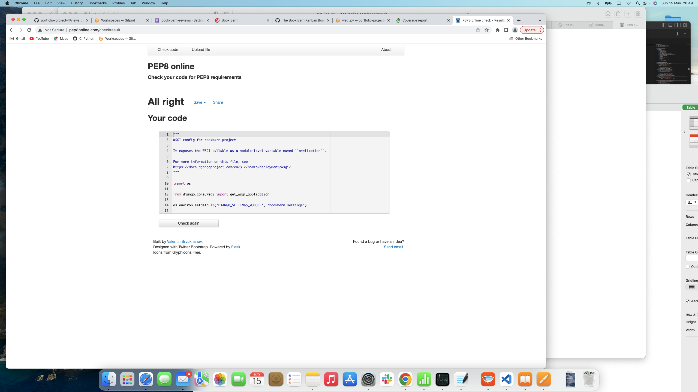

# Testing Report

## Manual Testing

## HTML/CSS Validation

CSS validation was carried out with the Jigsaw CSS Validator service. There was only a small amount of custom CSS included in this project, with most of the styling being done through bootstrap classes. There were no errors returned, with one warning which is due to a limitation of how Jigsaw operates.

#### CSS Validation on Jigsaw

HTML Validation was carried out with the W3C validator. An early version of the site flagged an error where I the links in the drop-down menu were incorrectly wrapped in just 'a' tags rather than 'li' tags as well, this error was fixed and no further problems occurred.

#### Home Page W3C HTML Validation

#### Reviews Page W3C HTML Validation

#### Add Review Page W3C HTML Validation

#### Search Page W3C HTML Validation

#### Category Page W3C HTML Validation

#### Profile Page W3C HTML Validation

#### Wishlist Page W3C HTML Validation

#### Logout Page W3C HTML Validation

## Python Validation

The Autopep8 package which comes with the Code Institute template was used to fix Python formatting errors in all files. This removed whitespace, fixed line spacing etc. There are a small number of errors remaining on setting.py and models.py . These are errors for lines being too long, and are due to a Cloudinary URL string and 4 Django authorization method names. All files were checked agains the [PEP8 validator](http://pep8online.com).

#### asgi.py Pep8 Validation

#### settings.py Pep8 Validation

#### Project urls.py Pep8 Validation

#### wsgi.py Pep8 Validation

#### admin.py Pep8 Validation

#### apps.py Pep8 Validation

#### models.py Pep8 Validation

#### templatehelpers.py Pep8 Validation

#### test_models.py Pep8 Validation

#### test_views.py Pep8 Validation

#### urls.py Pep8 Validation

#### views.py Pep8 Validation

## Accessibility

Accessibility testing was carried out with the [WAVE tool](https://wave.webaim.org/), all pages returned no errors found. All tags were properly filled in and there were no low-contrast areas of the side which would be difficult for users with poor vision. It should be noted that the online WAVE tool was only able to check pages where the user was not logged in. To check those pages I installed the Wave Chrome Extension which lets you check any page.

#### Home Page WAVE Test

#### Reviews Page WAVE Test

#### Login Page WAVE Test

#### Signup Page WAVE Test

#### New Review Page WAVE Test

#### Profile Page WAVE Test

#### Wishlist Page WAVE Test

#### Category Page WAVE Test

## Navigation

This test case is to verify that all the main links in the navbar take the user to the correct page. These links were tested by multiple people on different devices over a number of days. All tests were passed with no problems.

## Browse Reviews

This functionality is available to both registered and unregistered users. This test case confirms that a user can browse through the selection of book reviews on the site, use pagination, select a review and see the details of that review.

## Reviews CRUD Functionality

The Review model is the main component of this project, and it is important to verify that all Create, Read, Update and Delete functionality works flawlessly. Users can log into the site and create a new review. They can then look at the details of the review, edit or delete the review. This process was tested many times over the course of development and works perfectly.

## Comments CRUD Functionality

The Create, Read, Update and Delete operations all work function as expected for user comments. There were some initial problems early in development with attaching the comments to a review, but once I removed the slug field and used integer based ID fields to identify comments and reviews, this worked perfectly.

## Wishlist CRUD Functionality

The user wishlist is the third model that also utilises CRUD operations. Each user can add and remove books from their list, as well as toggling their status between read and unread. The site behaved as expected and no problems occurred.

## User Account

There is a large amount of important functionality connected with the user profile. This area has been tested exhaustively to ensure everything works correctly. Django's built-in user management is very good, and using the AllAuth package has made handling user registration, login and logout, and password resets much easier to handle. I used the Sendgrid API for email delivery as it works better than a personal Gmail account. The site can email a new user to verify their account, and use the same email to reset their password if needed. The user can also delete their account if they wish.

## Search

This test case tests if a user can enter a search term in the navbar search box, hit the enter key and be presented with a correct set of results. This functionality is available to all users registered and unregistered.

## Mobile

It is important to properly verify that the site works at multiple resolutions on different devices such as phones and tablets. The Bootstrap framework used in this project is well-suited to managing responsive designs and it was confirmed that the site works on small devices. The navbar and menu collapse down to a smaller menu which works well on small screens.

## User Stories

## Third Party Testing

## Unit Testing

